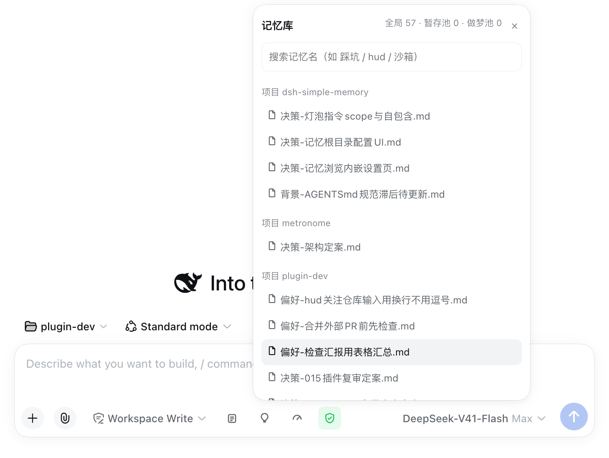

# dsh-simple-memory 🧠

[English](README.md) | [简体中文](README.zh-CN.md)


[](https://awesome-dsh-plugin.com)

A **simple memory keeper** plugin for [DeepSeek Harness](https://github.com/deepseek-ai/deepseek-harness) (`dsh`) web: retrieval-style memory with zero-code storage. No database, no vector store — just well-organized markdown files plus a thin plugin that handles the entry points. Normal work is never interrupted; memory accumulates as a **sidecar filesystem** beside your projects, and rules nudge you to record a note from time to time.

> **Status: core pipeline verified (0.2.0), real-world effect still under testing** — see [docs/verification-log](docs/全链路验证记录-2026-08-18.md) for the test run and [docs/design](docs/记忆系统设计说明.md) for how it works.

*Unofficial project: independently developed and maintained by a community member, not an official DeepSeek product.*

## Screenshot

**Memory button** (the bulb icon left of the input box): one click opens a **four-action menu** — Recall (review the turn, list candidates, write only after you confirm) / Promote (tidy the staging and dream pools, propose destinations) / Browse (list + search + read) / Dream (randomly combine memories for cross-project insights):


**Memory panel** (pick "Browse" in the menu): opens in place — project/global grouping + **search box** + click to read, with three pool counters on top (global · staging · dreams); click the bulb again, the ×, or anywhere outside to dismiss:



**Memory management page** (Settings → Memory): status overview, memory-root config, flat per-project lists plus global, click to read:


## Features

| Action | Effect |
|---|---|
| Open a session | A **three-part** memory index (current project progress body + 6 most recently touched notes + category counts for the rest) is injected once per session — the model both "remembers" what exists and sees where the project actually stands |
| Click the memory button | Opens a **four-action menu**: **Recall** (review the turn → list candidates with scope + reason → write only after you confirm) / **Promote** (tidy `staging.md` and `dreams.md` → propose destinations → execute after confirmation) / **Browse** (in-place panel: grouped list + search box + click to read) / **Dream** (randomly combine 3–5 memories for cross-project insights; output lands in the dream pool awaiting confirmation) |
| Write memory | The `memory-write` tool enforces the format (name `分类-主题.md`, ≤2KB, date header; scope = project/global) |
| Browse memory | In the input-bar panel or inline in the settings page: flat per-project lists + global common/, **with a search box**, click to read |
| Dream pool | `dreams.md` holds dreamt insights (entry memories + connection + suggested destination + status); **promoted into `common/` or the owning project only after you confirm** — same mechanism as staging: stash → confirm → promote |
| Cross-session search | `session_search` searches past session transcripts by keyword (time / workspace / title / best-match snippet); needs the official session full-text index enabled in the profile |
| Initialize | One click creates the repo skeleton (common/projects/references/archive/staging) + `git init` |
| Relocate | Change the memory root from the settings page — saved through the official settings service into the plugin's profile-entry config, so it **takes effect immediately, no restart** (DSH ≥ 0.1.7; older hosts fall back to editing the patch file and still need a restart) |

## Install

```bash
# DSH 0.1.7 and later:
dsh plugin --profile web add "github:a903067276-rgb/dsh-simple-memory#main"
# DSH 0.1.5 and older (this release needs 0.1.7+):
# dsh plugin --profile web add "github:a903067276-rgb/dsh-simple-memory#v0.3.8"
```

Restart `dsh web`, then Settings → Memory → Initialize memory repo.
Manual install fallback: see [docs/install.md](docs/install.md).

## Usage

- **Memory button** (the bulb icon left of the input box) — one click opens a **four-action menu** (instructions are self-contained, no AGENTS.md needed):
  - **Recall**: review the turn → list what is worth remembering (decisions/pitfalls/conventions/preferences) with scope (project/global) + reason → **write only after you confirm** → show output → commit.
  - **Promote**: read `staging.md` (staging pool) and `dreams.md` (dream pool) → decide each item's destination (promote into `common/` or the owning project; suggest dropping duplicates/outdated ones) → propose for your confirmation → execute and remove from the pool.
  - **Browse**: open an in-place panel (project/global grouping + **search box** + click to read) without spending a conversation turn.
  - **Dream**: randomly draw 3–5 memories library-wide, look for shared root causes / contradictions / transferable solutions / gaps → at most 2–3 insights → written to the dream pool (with suggested destination, status "pending").
- **Settings → Memory** — status overview (global count · staging pool · dream pool), memory-root config, one-click repo init, and an inline browser: flat per-project lists plus global, click to read.

## Platform support

| Platform | Status |
|---|---|
| macOS | ✅ development environment |
| Linux | ⚠️ expected to work (plain file operations), untested |
| Windows | ⚠️ expected to work (plain file operations), untested |

## Requirements

- DSH web >= 0.1.0-rc.6
- **Version compatibility** (best effort — the settings card uses dual-field `key`+`id` registration to satisfy both rc.6 (`id`) and rc.7+ (`key`); verified locally on rc.6/rc.8/0.1.1-rc.2/0.1.5-rc.1, **not guaranteed on every DSH version**):
  - DSH 0.1.0-rc.6 and newer (incl. 0.1.1-rc.1/rc.2): try `main` (default).
  - **DSH 0.1.5-rc.1: load-verified** (plugin present in the client bundle, host half loaded, settings section rendered); memory I/O uses its own `/api/dsh-simple-memory` routes and touches none of the contracts changed in 0.1.5. UI interactions were not eyeballed item by item.
  - Conservative fallbacks (the last pre-0.1.1 build): DSH 0.1.0-rc.7/rc.8 → `v0.2.5` (`dsh plugin add github:a903067276-rgb/dsh-simple-memory#v0.2.5`); DSH 0.1.0-rc.6 → frozen `rc6-compat` tag (no maintenance).
- git CLI (optional: without git, the memory repo is just a plain directory)
  - ✅ **DSH 0.1.7 and later — use this release (`v0.4.0`)**: it declares `peerDependencies: {"@deepseek-ai/dsh": ">=0.1.7-rc.1 <0.2.0"}`, so a mismatched host refuses to load it with an explicit reason instead of failing quietly. Settings move to the 0.1.7 model (plugin `Config`, live-editable `.volatile()` fields), so changes apply without a restart.
  - ⚠️ **DSH 0.1.5 and older — install the previous tag `v0.3.8`**: that line keeps the old behavior and uses no 0.1.7-only API.
  - ⛔ **Old plugin releases (up to `v0.3.8`) are not supported on 0.1.7** — the first turn of every session fails (session format V4 rejects the old injected-message source) and settings are lost. Upgrade the plugin together with the host.
- **Maintenance policy**: this plugin keeps evolving with the latest DSH releases; compatibility with older DSH versions is best-effort only and not guaranteed going forward.

## How it works

A retrieval-style memory: files are the storage, the plugin only handles the entry points. Full design: [docs/记忆系统设计说明](docs/记忆系统设计说明.md).

- **Storage (zero code)** — everything lives in one memory root `~/Documents/DSH/memory/` (configurable from the settings page):
  ```
  memory/
  ├── common/          global experience (active zone, cross-project reuse)
  ├── projects/<name>/ per-project memory (auto-created on first write)
  ├── references/      cold zone: reference material (search-only)
  ├── archive/         cold zone: forgotten memory moved out of the index
  ├── staging.md       promotion pool (candidates for global reuse)
  └── .git/            one git repo for the whole root — rollback safety
  ```
  Per-project memory does NOT live inside the project directory: a `.gitignore`'d `memory/` would hide it from grep. Keeping it in the shared root keeps publication isolation automatic and search universal.

- **Index injection (three-part)** — on the first step of every session (`agent/pre-step`): (1) the **current project progress body** (`progress/<project>.md`, so resuming shows real state rather than stale state; flagged "stale" past 14 days, ages resolved to minutes/hours); (2) the **6 most recently touched notes** (title + first-line conclusion, project + global by mtime, so recent pitfalls surface by themselves); (3) everything else as **category counts + a search entry point** (use `memory_search` instead of reading the list). `docs/` keeps its file names — that directory sits outside the memory root and search cannot reach it. Measured at about **2536 characters / 2024 tokens** (cl100k; ~1450-1700 with DeepSeek's Chinese tokenizer), and it **does not grow with the number of notes**. Cold zones (`references/`, `archive/`) are not injected — searched only when a topic hits.

- **Write tool (records it)** — `memory-write` enforces the format: filename `分类-主题.md`, first line `## date 分类-主题`, ≤2KB, category prefixes open (built-in: 踩坑/流程/决策/偏好/背景). `scope` picks project or global. Writing outside the workspace asks for approval (built-in confirmation).

- **Memory button (four-action menu)** — the bulb icon in the input bar opens: **Recall** (review the turn → propose items with scope + reason → wait for confirmation → `memory-write` → show output → commit) / **Promote** (tidy `staging.md` + `dreams.md` → propose destinations → execute and remove from pool after confirmation) / **Browse** (in-place panel: grouped list + search + click to read) / **Dream** (randomly combine 3–5 memories → at most 2–3 insights → written to the dream pool as pending).

- **Settings page (manage + browse)** — status line (active count · staging count · dream-pool count), memory-root config, one-click repo skeleton init (includes `staging.md` / `dreams.md` templates), and an inline browser listing every project flat plus global, click to read.

- **Search (finds it)** — no index files: the agent's grep scans the whole memory root (all projects + global + cold zones) in one pass, active zones first.

- **Cross-session search (asks "when did we talk about X")** — `session_search` queries the official session full-text index (`session-query-sqlite`) and returns the matching sessions' time / workspace / title / best-match snippet.
  - Prerequisite: override `session-query-sqlite`'s `openAt` to `first-search` (plus a durable `path`) in the profile's `cordis.patch.yml`, then restart dsh. When the index is off, the tool returns an actionable notice instead of an error.
  - **Known limitation (measured 2026-09-10)**: the official index build scans every persisted session, so **one unreadable legacy log fails the entire search** (`session-search persistence observation failed: …`). On this machine 27 of 150 session logs triggered it (mostly `subagent/descriptor … uses unsupported descriptor version 2`, plus two hand-repaired `chunk provenance` cases); moving them out of the sessions directory made search work. Record: [docs/验证记录-2026-09-10-session_search.md](docs/验证记录-2026-09-10-session_search.md).

- **Promotion (cross-project reuse)** — project memory that looks reusable goes into `staging.md` (low friction, no instant decision); when the pool is non-empty the user is reminded (index tail + write-tool hint), and after confirmation it is distilled into `common/` or the owning project and removed from the pool.

- **Dreaming (random recombination)** — draw 3–5 memories library-wide and look for shared root causes / contradictions / transferable solutions / gaps; output goes to `dreams.md` (with suggested destination + "pending" status) and is **promoted only after user confirmation** — the same downstream mechanism as staging (stash → confirm → promote). **Association strategy (2026-09-13)**: sampling stays purely random, but start from *fragmentary* notes (pitfalls / undigested raw records) and go easy on forcing connections between finished decisions; an insight must state something the source notes never say outright — restating them is not an insight. If nothing real comes out, say "no dream this time" and leave the pool empty.

- **Unified pool-counting rule (2026-09-13)** — index-tail reminders and the settings/browse counters count **pending items only**: lines marked `[已弃]`/`[已采纳]` in `dreams.md`, and any trace written in a non-entry format, are **not counted**; entries missing a status marker are still counted (better to over-remind than to hide pending work). Keep traces as `（已弃：…）`-style non-entry notes.

- **Forgetting (fresh context)** — outdated notes move to `archive/` (soft delete: still on disk, just out of the index). Context stays lean, disk stays complete.

- **Rollback** — every memory operation is committed immediately (`mem: <action> <subject>`); a wrong write is one `git checkout` away.

## Notes

- Memory git repos are local-only, never pushed to a remote.
- Writing memory outside the workspace asks for approval (built-in confirmation, per the memory spec).
- The four-action instructions (Recall / Promote / Dream) are self-contained and do not depend on the global AGENTS.md; the judgment rules there are only a reference.

## License

[MIT](LICENSE)
