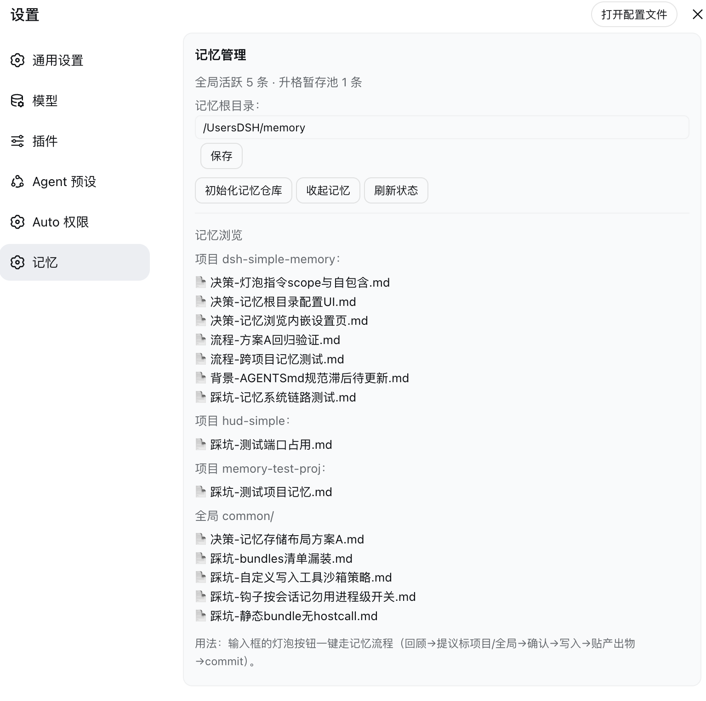

# dsh-simple-memory 🧠

[English](README.md) | [简体中文](README.zh-CN.md)


[](https://awesome-dsh-plugin.com)

面向 [DeepSeek Harness](https://github.com/deepseek-ai/deepseek-harness)（`dsh`）web 的**简单记忆管家**：检索式记忆，存储零代码。不建数据库、不搞向量检索——就是"组织好的 md 文件 + 一个只管入口的薄插件"。正常干活不受打扰，记忆作为**外挂文件系统**在旁边积累，规则时不时提醒你记一笔。

> **状态：核心链路已通（0.2.0），真实使用效果待长期测试**——测试流程与结果见 [docs/全链路验证记录](docs/全链路验证记录-2026-08-18.md)，设计原理见 [docs/记忆系统设计说明](docs/记忆系统设计说明.md)。

*非官方项目：社区成员独立开发维护，非 DeepSeek 官方产品。*

## 截图

**记忆按钮**（输入框左侧灯泡）：一键触发记忆流程——回顾 → 逐条提议（标明记项目还是全局）→ 确认 → 写入 → 贴产出物 → commit：


**记忆管理页**（设置 → 记忆）：状态总览、记忆根目录配置、平级项目列表 + 全局，点开即读：



## 功能

| 操作 | 效果 |
|---|---|
| 开会话 | 自动注入记忆索引（当前项目 + 全局 + 记忆根游离，每会话首轮一次）——模型"想得起"有什么 |
| 点记忆按钮 | 输入框插入固定"记忆流程指令"——模型走规范流程（回顾→提议标 scope→确认→写入→贴产出物→commit） |
| 写记忆 | `memory-write` 工具强制格式（文件名 `分类-主题.md`、≤2KB、日期首行；scope=项目/全局） |
| 浏览记忆 | 设置页内嵌浏览：所有项目平级列表 + 全局 common/，点开即读全文 |
| 初始化 | 设置页一键建目录骨架（common/projects/references/archive/staging）+ `git init` |
| 改位置 | 设置页改记忆根目录（写 patch 配置，重启生效） |

## 安装

```bash
dsh plugin --profile web add "github:a903067276-rgb/dsh-simple-memory#main"
```

装完重启 `dsh web`，设置 → 记忆 → 初始化记忆仓库。
手动兜底安装：见 [docs/install.md](docs/install.md)。

## 用法

- **记忆按钮**（输入框左侧灯泡）——一键插入固定自包含的"记忆流程指令"；模型随后走规范流程（回顾 → 逐条提议并标明 scope（项目/全局）+ 理由 → 确认 → 写入 → 贴产出物 → commit）。
- **设置 → 记忆**——状态总览、记忆根目录配置、一键初始化仓库、内嵌浏览（所有项目平级 + 全局，点开即读）。

## 平台支持

| 平台 | 状态 |
|---|---|
| macOS | ✅ 开发环境 |
| Linux | ⚠️ 预期可用（纯文件操作），未实测 |
| Windows | ⚠️ 预期可用（纯文件操作），未实测 |

## 环境要求

- DSH web（≥ 0.1.0-rc.7）
- git CLI（可选：没有 git，记忆目录就是普通文件夹）

## 工作原理

检索式记忆：**文件即存储，插件只管入口**。完整设计见 [docs/记忆系统设计说明](docs/记忆系统设计说明.md)。

- **存储（零代码）**：记忆统一收在记忆根 `~/Documents/DSH/memory/`（设置页可改）：
  ```
  memory/
  ├── common/          全局经验（活跃区，跨项目复用）
  ├── projects/<项目名>/  项目经验（首次写入自动建目录）
  ├── references/      冷区：参考资料（命中搜索才读）
  ├── archive/         冷区：被遗忘移出的旧记忆
  ├── staging.md       升格暂存池（跨项目复用候选）
  └── .git/            整个记忆根一个 git 仓库——回滚保障
  ```
  项目记忆**不落项目目录**（`.gitignore` 掉 `memory/` 会挡住 grep）——收在共享根，发布隔离天然成立、检索全局覆盖。

- **索引注入（想得起）**：每会话首步（`agent/pre-step`）注入**文件名清单**（不灌内容），按分类分组，覆盖当前项目 + 全局 + 记忆根游离文件；模型相关时按需读全文（每条 ≤2KB）。冷区不注入，命中搜索才读。

- **写入工具（记得住）**：`memory-write` 强制格式（文件名 `分类-主题.md`、首行日期、≤2KB、分类开放自造：踩坑/流程/决策/偏好/背景起步）；`scope` 二选一（项目/全局）。写工作区外自动弹审批（= 写入前确认）。

- **记忆按钮（触发流程）**：输入框左侧灯泡，点击插入固定自包含指令：① 回顾对话 ② 逐条提议并标明 scope（项目/全局）+ 理由 ③ 等用户确认 ④ memory-write 写入 ⑤ 贴产出物 ⑥ git commit（`mem: 记 xxx`）。

- **设置页（管理+浏览）**：状态行（活跃条数、staging 条数）、记忆根目录配置、一键初始化骨架、内嵌浏览（所有项目平级 + 全局，点开即读）。

- **检索（找得到）**：不建索引文件，agent 的 grep 直接搜整个记忆根（所有项目 + 全局 + 冷区），先活跃后冷区。

- **升格（跨项目复用）**：项目经验看着可复用 → 入 `staging.md`（低摩擦，不逼当场决策）；池子非空提醒 → 用户点头 → 提炼入 `common/` → 出池删条目。

- **遗忘（上下文保鲜）**：过期的活跃记忆移入 `archive/`（软删除：还在硬盘，只退出索引）。上下文永远清爽，硬盘永远完整。

- **回滚**：每次记忆操作立即 commit（`mem: <操作> <对象>`），写错一个 `git checkout` 回来。

## 注意事项

- 记忆 git 仓库仅本地，不推远端
- 写记忆在工作区外会弹审批（= 写入前确认，符合记忆规范）
- 记忆流程指令自包含，不依赖全局 AGENTS.md；AGENTS.md 里的判断标准仅作参考

## 许可证

[MIT](LICENSE)
